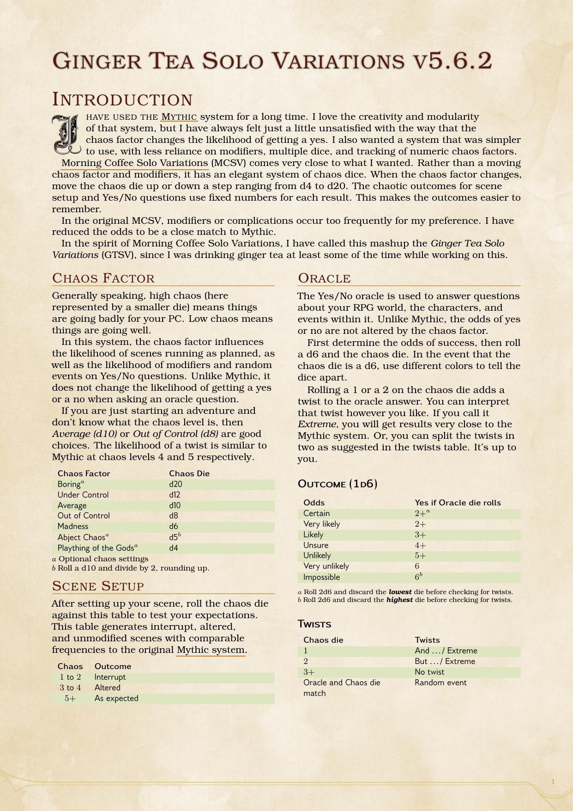

# Ginger Tea Solo Variations

## Oracles for Solo RPGs

I have used the [Mythic](https://www.wordmillgames.com/mythic-gme.html) system
for a long time. I love the creativity and modularity of that system, but I have
always felt just a little unsatisfied with the way that the chaos factor changes
the likelihood of getting a yes. Additionally, I wanted a system that was
simpler to use, with less reliance on modifiers, multiple dice, and tracking of
numeric chaos factors.

[Morning Coffee Solo
Variations](https://aleaiactandaest.blogspot.com/p/downloads.html) (MCSV) comes
very close to what I wanted. Rather than a chaos factor that needs to be
tracked, and that provides a moving target for interpretation during rolls, it
has an elegant system of chaos dice. When the chaos factor changes, move the
chaos die up or down a step from d4 to d20. The chaotic outcomes for scene setup
and Yes/No questions use fixed numbers for each result. This makes the outcomes
easier to remember. However, MCSV just gives the *and ...*, *but ...*,
and *random event* modifiers for Yes/No questions. I always liked the
*exceptional* results in Mythic, so I have modified the qualification table to
add *exceptional* as an option. I also reduced the odds of an oracle modifier,
bringing them closer to those in Mythic.

## Getting The Files

The *gtsv_\** files contain the PDF versions of the full system in all combinations
of A4, letter, full-colour, and print-friendly versions.

The *gtsv_essential_tables_\** files contain just the essential system tables without
any of the explanatory text. Hopefully perfect for printing as a reference.

## A Shout-Out to DnD 5e LaTeX Template

Formatting in the style of the fifth edition of the *world's greatest
roleplaying game* courtesy of the lovely [DnD 5e LaTeX
Template](https://github.com/rpgtex/DND-5e-LaTeX-Template).

